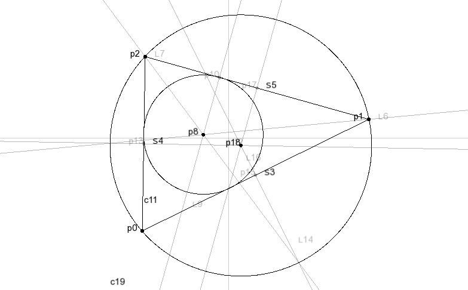
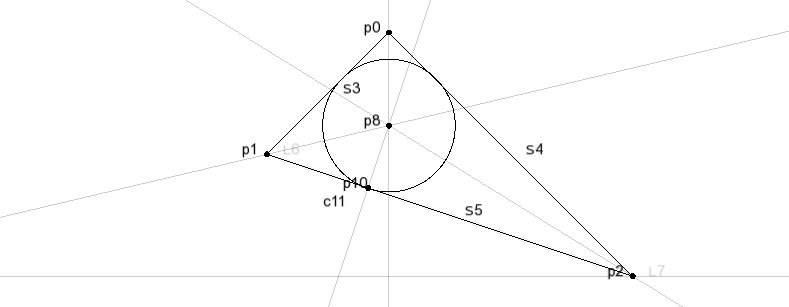
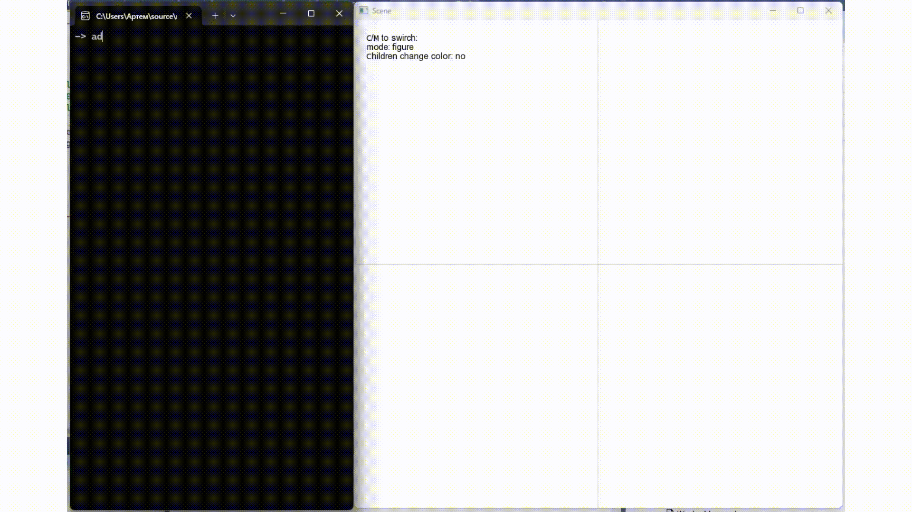
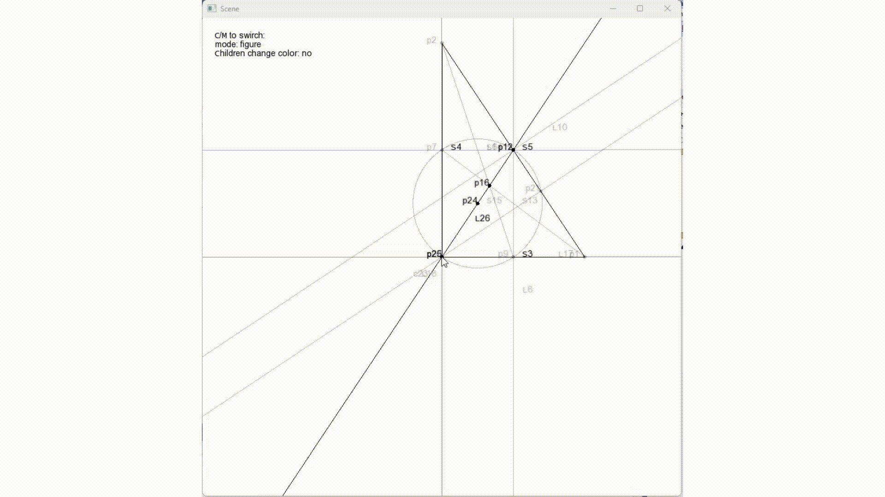

# 2D  геометрическое ядро
---

## Описание проекта

Двухмерное геометрическое ядро с многопоточной архитектурой: ввод команд осуществляется через консоль, а интерактивная визуализация — в отдельном окне.

### Возможности:

- Построение базовых геометрических фигур: точек, прямых, отрезков, окружностей
- Создание зависимых объектов (параллельные, перпендикуляры, биссектрисы и т.п.)
- Построение точек пересечения объектов
- Связывание объектов в дерево зависимостей: при изменении базовых объектов все зависимые автоматически обновляются
- Интерактивное перемещение объектов

## Технологии
- **C++17**
- **SFML** — визуализация
- **Собственный логгер**
- **Собственная библиотека юнит-тестов**

## Пример работы
### Вписанная окружность

```consle
add point 0 2  
add point -1 1 
add point 2 0 
add sline p 0 1  
add sline p 0 2  
add sline p 1 2  
bi p 0 1 2  
bi p 0 2 1  
inter line 6  line 7  
pp 5  p 8  
inter line 9  line 5  
add circle p 8 10
inf 11                  // center (0, 1.23607), radius = 0.540182
color 0 0 0 50 to 7,6,9
```
Ожидаемый результат: `center (0, 1.23607), radius = 0.540182`


### Прямая Эйлера



## Доступные команд
 Обращение к существующим объектам идет по их индексам
###  Добавление объектов

#### Базовые объекты

Точка  
`-> add point x y`  
Прямая или отрезок по 2 точкам или по координатам  
`-> add [line, sline] [p ind1 ind2 | c x1 y1 x2 y2]`  
Окружность по 2 точкам (центр и точка на окружности) или по 3 точкам  
`-> add circle [p ind1 ind2 | c x1 y1 x2 y2 | 3p ind1 ind2 ind3]`  
#### Зависимые объекты 

Параллельная прямая по прямой и точке  
`-> [ll | parallel] line_ind [p point_ind | c x1 y2`  
Перпендикулярная прямая по прямой и точке  
`-> [pp | perpendicular] line_ind [p point_ind | c x1 y2]`  
Серединный перпендикуляр по 2 точкам  
`-> [mp | medianPerpendicular ] [p ind1 ind2 | c x1 y1 x2 y2]`  
Средняя точка между 2 точек  
`-> [mid | midpoint ] [p ind1 ind2 | c x1 y1 x2 y2]`  
Биссектриса по 3 точкам  
`-> [bi | bisectrix ] [p ind1 ind2 ind2 | c x1 y1 x2 y2 x3 y3]`  
Центр окружности  
`-> [cc | circlecenter] circle_ind`  
Точка принадлежащая другому объекту, проектирует уже существующую точку или создает по новым координатам  
`-> belong parend_ind [p point_ind | c x y]`  
###  Операции над объектами

Передвижение объекта номер `ind` на вектор `(x,y)`  
`-> move ind to x y`  
Удаление индексу  
`-> delete ind`  
Удалить всё  
`-> deleteAll`  
Пересечение  
`-> [inter | intersection] obj1_type obj1_ind obj2_type obj2_ind `  
###  Дополнительные 

Информация об объекте  
`-> inf obj_ind`  
Изменить цвет объекта  
`-> color r g b a to obj_ind`  
Изменить базовый цвет объектов  
`-> colorDef r g b a`  
Изменить цвет всех объектов  
`-> colorAll r g b a`  
Выход из приложения  
`-> exit`  
